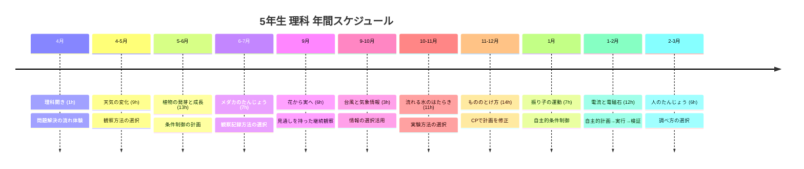
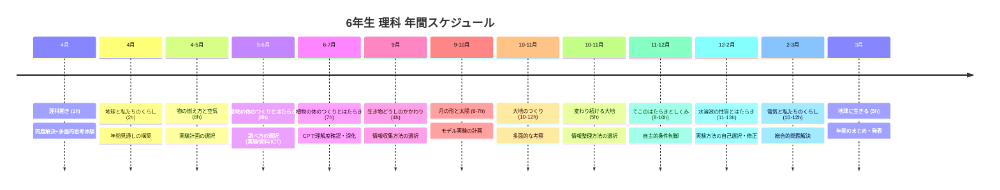

# 年間指導計画

**5年・6年 理科 2026年度**

---

## 5年生 年間指導計画（105時間）

!!! info "計画の特徴"
    5年生では、身近な自然現象の観察・実験を通じて、問題解決の流れを習得することが中心となります。特に「選択」と「振り返り」の経験を積み重ね、自己調整学習の基礎を築きます。

### 年間の流れ

### 詳細計画表

| # | 単元名 | 時数 | 時期 | 研究の重点 | 主な学習内容 |
|:-:|--------|------|------|----------|-----------|
| 0 | **理科開き** | 1h | 4月 | 問題解決の流れを体験 | 身近な自然現象から問題を見つけ、予想→実験→結論の流れを経験 |
| 1 | **天気の変化** | 9h | 4-5月 | 観察方法の選択 | 天気の変化を観察する方法を複数提示し、児童が選択。気象計器の使い方を習得 |
| 2 | **植物の発芽と成長** | 13h | 5-6月 | 条件制御の計画 | 種子の発芽条件を児童が計画して調べる。チェックポイントで進捗を確認 |
| 3 | **メダカのたんじょう** | 7h | 6-7月 | 観察記録方法の選択 | メダカの成長を観察。記録方法（スケッチ、文章、動画など）を児童が選択 |
| 4 | **花から実へ** | 6h | 9月 | 見通しを持った継続観察 | 前年度の観察と比較しながら、花から実への変化を追跡観察 |
| 5 | **台風と気象情報** | 3-4h | 9-10月 | 情報の選択と活用 | 気象情報の読み取り、台風の性質について、複数の情報源から必要な情報を選択 |
| 6 | **流れる水のはたらき** | 11-12h | 10-11月 | 実験方法の選択 | 流水による浸食・運搬・堆積を実験で確認。実験装置の工夫を児童が提案 |
| 7 | **もののとけ方** | 14h | 11-12月 | CPで計画を修正 | 物質の溶解現象を実験で調べる。CPで理解度を確認し、実験計画を修正する経験 |
| 8 | **振り子の運動** | 7-8h | 1月 | 自主的条件制御 | 振り子の周期と条件の関係を児童が自分で計画して調べる |
| 9 | **電流と電磁石** | 12h | 1-2月 | 自主的計画→実行→検証 | 電磁石の強さを変える条件を児童が独立して調べ、結果を検証する |
| - | **人のたんじょう** | 6h | 2-3月 | 調べ方の選択 | 人の成長と生殖について、複数の学習方法（資料・模型・映像）から選択して学習 |

**合計**: 105時間（理科開き含む）

---

## 6年生 年間指導計画（105時間）

!!! info "計画の特徴"
    6年生では、より複雑な自然現象を対象に、多面的な考察力と総合的な問題解決能力の育成に重点を置きます。自己調整学習の完成段階として、児童が自ら計画を立案し、検証する経験を充実させます。

### 年間の流れ

### 詳細計画表

| # | 単元名 | 時数 | 時期 | 研究の重点 | 主な学習内容 |
|:-:|--------|------|------|----------|-----------|
| 0 | **理科開き** | 1h | 4月 | 問題解決+多面的思考を体験 | 1つの現象から多角的に問題を見つけ、予想の多様性を尊重 |
| - | **地球と私たちのくらし**（導入） | 2h | 4月 | 年間見通しの構築 | 地球環境と人間のくらしのつながりを認識し、年間学習の見通しを持つ |
| 1 | **物の燃え方と空気** | 8h | 4-5月 | 実験計画の選択 | 燃焼の条件を調べる実験方法を複数提示し、児童が最適な方法を選択 |
| 2 | **動物の体のつくりとはたらき** | 8h | 5-6月 | 調べ方の選択（実験・資料・ICT） | 人や動物の体の仕組みを、解剖観察・資料学習・映像視聴から選択して学習 |
| 3 | **植物の体のつくりとはたらき** | 7h | 6-7月 | CPで理解度を確認し深化 | 根・茎・葉の働きを実験で調べ、CPで学習定着を確認し補充学習に活用 |
| 4 | **生き物どうしのかかわり** | 4h | 9月 | 情報収集方法の選択 | 食物連鎖などを図書・インターネット・野外観察から情報を選択して学習 |
| 5 | **月の形と太陽** | 6-7h | 9-10月 | モデル実験の計画 | 月の見え方を説明するモデルを児童が計画・製作し、検証する |
| 6 | **大地のつくり** | 10-12h | 10-11月 | 多面的な考察 | 地層・岩石・鉱物について、複数の視点（時間スケール、風化・堆積など）で考察 |
| 7 | **変わり続ける大地** | 5h | 10-11月 | 情報整理方法の選択 | 地震・火山などの地動現象を、複数の資料から情報を選択・整理して学習 |
| 8 | **てこのはたらきとしくみ** | 8-10h | 11-12月 | 自主的条件制御 | てこの規則性を実験で調べ、児童が自分で条件を変えて検証する |
| 9 | **水溶液の性質とはたらき** | 11-13h | 12-2月 | 実験方法の自己選択・修正 | 酸性・アルカリ性など水溶液の性質を調べる方法を児童が自分で選択・修正 |
| 10 | **電気と私たちのくらし** | 10-12h | 2-3月 | 総合的問題解決 | 電気利用に関する課題について、自分で調べ方を計画し、提案する活動 |
| 11 | **地球に生きる** | 5h | 3月 | 年間のまとめ・発表 | 学習内容を統合し、地球環境への自分たちの役割について発表・議論 |

**合計**: 105時間（理科開き・地球導入含む）

---

## 学年別の学習の流れ

### 5年生の学習の特徴

!!! note "成長段階"
    - **基礎の習得**: 観察・実験の基本的な進め方を習得
    - **選択肢の経験**: どの方法で学ぶかを試行錯誤
    - **振り返りの習慣化**: 毎時間のふり返りを通して自己認識を深める

!!! tip "指導の工夫"
    - 観察・実験の方法を明確に提示
    - 選択肢を限定的に提供（3～4個程度）
    - ふり返りはシート形式で構造化

---

### 6年生の学習の特徴

!!! note "成長段階"
    - **自立的な計画**: 観察・実験を児童が主体的に計画
    - **多面的な思考**: 1つの現象から複数の視点で考察
    - **総合的問題解決**: 複数の単元の知識を統合して課題解決

!!! tip "指導の工夫"
    - 学習方法の選択肢を拡大
    - 児童による計画案を先に引き出す
    - 議論・協働学習の充実

---

## 研究との関連

### 各単元と研究の視点

#### 見通しを関連させる単元

| 学年 | 単元 | 見通しの具体例 |
|------|------||
| 5年 | 植物の発芽と成長 | 発芽から開花までの生育段階をチャートで提示 |
| 5年 | メダカのたんじょう | 卵から成魚までの発育段階を時系列で提示 |
| 6年 | 地球と私たちのくらし | 年間12単元の地球環境をシステムとして提示 |
| 6年 | 大地のつくり | 何億年という時間スケールで地層形成を可視化 |

#### 選択肢を活用する単元

| 学年 | 単元 | 選択肢の例 |
|------|------|-----------|
| 5年 | 天気の変化 | 気象計器の使い方、記録方法、予報方法 |
| 5年 | もののとけ方 | 溶解速度を変える方法（温度/撹拌/粒度など）の選択 |
| 6年 | 物の燃え方と空気 | 燃焼の条件を調べるための実験設計の選択 |
| 6年 | 動物の体のつくり | 学習方法（解剖/模型/映像/図書）の選択 |

#### 振り返り（CP）を重視する単元

| 学年 | 単元 | CP の活用 |
|------|------|-----------|
| 5年 | もののとけ方 | 実験結果をもとに次の条件設定を検討 |
| 6年 | 植物の体のつくり | 根・茎・葉それぞれの働きを確認して理解を深める |
| 6年 | 水溶液の性質 | 性質の判定結果をもとに検査方法を修正 |

---

## 指導計画の使い方

!!! tips "効果的な活用"

    1. **授業準備時**: 単元の概要を確認し、教材研究の視点を明確化
    2. **単元開始時**: 児童に年間計画と該当単元を提示し、見通しを持たせる
    3. **授業中**: 各単元の「研究の重点」を意識した学習活動の設計
    4. **評価時**: CPとふり返りで児童の自己調整学習の進度を評価
    5. **次年度準備**: 実践報告から得られた改善点を次年度計画に反映

---

**参考資料**: 文部科学省『小学校学習指導要領（平成29年告示）解説 理科編』

**作成者**: 中 龍馬（理科専科）
**作成日**: 2026年4月
